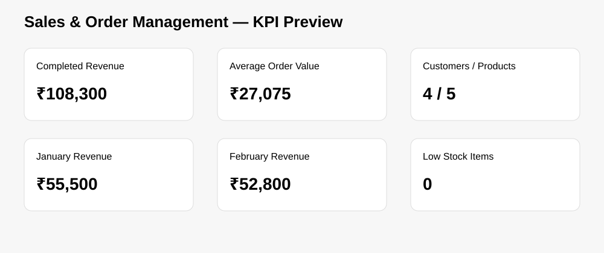
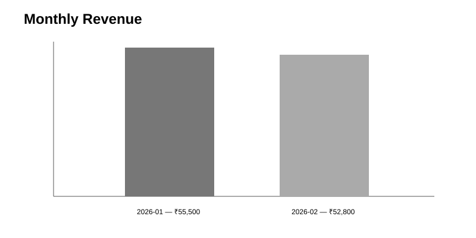
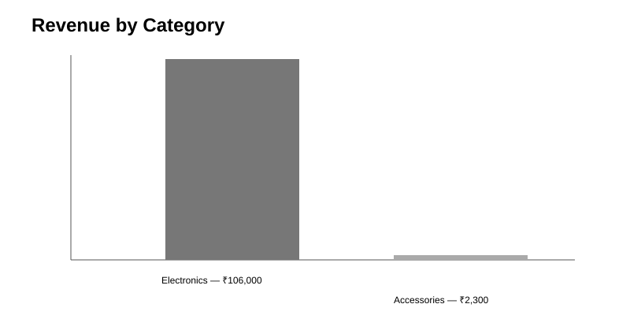
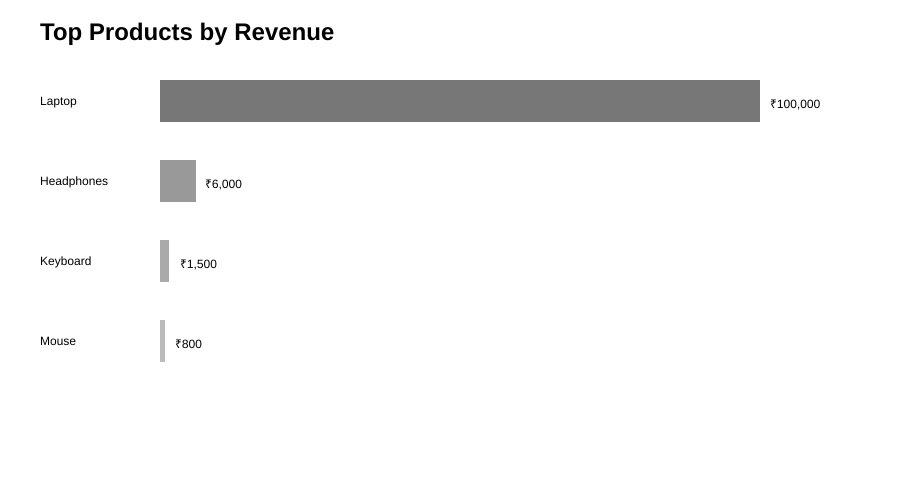

# Sales & Order Management Analytics System

A portfolio-ready Python + SQL sales and order management application with a SQLite database, transaction-safe business workflows, analytics queries, and an interactive Gradio dashboard.

## 🚀 What This Project Demonstrates

This project is designed as an internship-ready portfolio application rather than a single notebook.

- Relational database design with SQLite
- SQL joins, grouping, aggregation and filtering
- Python application development
- Pandas analytics and Matplotlib visualization
- Gradio dashboard development
- Transaction-safe order processing
- Inventory validation and stock restoration
- Order lifecycle and payment tracking
- Search and filtering
- Automated tests with pytest
- GitHub Actions CI
- Docker-ready deployment
- Environment-based configuration
- Reproducible built-in demo data

## ✨ Features

### Customer Management
- Add customers
- Validate required fields
- Prevent duplicate emails
- Search by name, email or city

### Product & Inventory Management
- Add products
- Validate price and stock
- Search by product name or category
- View inventory value
- Low-stock monitoring
- Restock products

### Order Management
- Create orders
- Validate customer and product
- Prevent ordering more than available stock
- Automatically reduce inventory
- Transaction-safe order creation
- View order details
- Search orders
- Track lifecycle: PROCESSING → SHIPPED → COMPLETED
- Cancel orders and restore stock automatically

### Payment Management
- Payment records linked to orders
- Payment search
- PAID status for checkout
- REFUNDED status when an order is cancelled

### Analytics Dashboard
- Total revenue, orders, customers and products
- Average order value and inventory value
- Low-stock count
- Monthly and daily sales
- Category performance
- Top products
- Customer ranking
- Payment and order status analysis
- Inventory value by product

## 🧠 Business Logic

Order creation is handled as a database transaction:

```text
Validate customer
      ↓
Validate product
      ↓
Validate quantity and stock
      ↓
Create order
      ↓
Create order item
      ↓
Reduce inventory
      ↓
Create payment record
      ↓
Commit transaction
```

If a database error occurs, the transaction is rolled back so partial updates are not left behind.

Order cancellation reverses the inventory change and marks the related payment as REFUNDED.

## 📊 Demo Visuals

The following data-driven previews are generated from the built-in demo dataset.









## 💡 Business Insights from the Demo Dataset

The built-in demo data contains 4 customers, 5 products and 4 completed orders.

- **Completed revenue:** ₹108,300.
- **Average order value:** ₹27,075.
- **Electronics generated ₹106,000**, about **97.9% of total completed revenue**.
- **Laptop revenue was ₹100,000**, about **92.3% of total completed revenue**.
- **Laptop + Headphones generated ₹106,000**, about **97.9% of total completed revenue**.
- January revenue was **₹55,500**, while February revenue was **₹52,800**.
- The demo dataset shows a highly concentrated revenue mix, with laptops driving most sales value.

These findings come from the same seed data used by the application.

## 🏗️ Architecture

```text
                    Gradio UI
                        │
                        ▼
                     app.py
                ┌───────┴────────┐
                ▼                ▼
          database.py       analytics.py
                │                │
                └───────┬────────┘
                        ▼
                    SQLite DB
```

- `app.py` — UI, validation and business workflows
- `database.py` — SQLite connection, schema and seed data
- `analytics.py` — SQL queries, Pandas analysis and charts
- `tests/` — automated database tests
- `.github/workflows/` — continuous integration
- `Dockerfile` — container deployment
- `.env.example` — environment configuration

## 🗄️ Database Design

```text
customers
   │
   └── orders
          │
          ├── order_items ─── products
          │
          └── payments
```

| Table | Purpose |
|---|---|
| customers | Customer information |
| products | Product and inventory information |
| orders | Order header and lifecycle status |
| order_items | Products and quantities in an order |
| payments | Payment records linked to orders |

## 🛠️ Tech Stack

Python 3.11+ · SQLite · SQL · Pandas · Matplotlib · Gradio · pytest · GitHub Actions · Docker

## ▶️ Run Locally

The project runs as a normal Python application and is **not dependent on Google Colab**.


```bash
git clone https://github.com/premkarthiks149-ak/sales-order-management-analytics.git
cd sales-order-management-analytics
python -m venv .venv
```

Windows:
```text
.venv\Scripts\activate
```

macOS/Linux:
```text
source .venv/bin/activate
```

Then:
```bash
pip install -r requirements.txt
python app.py
```

The app uses port 7860 by default.

### Demo data

The database automatically creates the schema and seeds demo data on first run.

To verify the demo dataset:

```bash
python scripts/seed_demo_data.py
```

Expected:

```text
Demo dataset is ready.
customers: 4 rows
products: 5 rows
orders: 4 rows
order_items: 7 rows
payments: 4 rows
```

## ⚙️ Configuration

Supported environment variables:

- `DATABASE_PATH` — SQLite database file path
- `PORT` — application port

Example:

```text
DATABASE_PATH=sales_analytics.db
PORT=7860
```

## 🧪 Testing

```bash
pytest -q
```

GitHub Actions runs the test suite automatically on pushes and pull requests.

## 🐳 Docker

```bash
docker build -t sales-analytics .
docker run -p 7860:7860 sales-analytics
```

## ☁️ Deployment

The application can run outside Google Colab on Hugging Face Spaces, Docker-based hosting, or other Python-compatible cloud platforms.

### Hugging Face Spaces

The repository is Docker-ready for a free Hugging Face Docker Space:

1. Create a new Space and select **Docker**.
2. Connect/upload this repository.
3. Keep the application port at `7860`.
4. Set `DATABASE_PATH` if persistent storage is available.
5. Verify the Gradio dashboard after the build.

A live URL is not listed until the application is actually deployed; this avoids publishing a fake demo link.

For production, use persistent storage or migrate the SQLite layer to PostgreSQL/MySQL.

## 📊 Business Questions Answered

- What is completed revenue?
- Which products generate the most revenue?
- Which category performs best?
- Which customers generate the most revenue?
- Which products have low stock?
- How are sales changing over time?
- What is current inventory value?
- How many orders are in each lifecycle state?
- What is the payment status distribution?

## 🔐 Production Considerations

This is an internship/portfolio project, not a full enterprise ERP.

Future production upgrades could include authentication, role-based permissions, PostgreSQL, migrations, API endpoints, audit logging, monitoring and end-to-end tests.

## 📁 Project Structure

```text
sales-order-management-analytics/
├── app.py
├── database.py
├── analytics.py
├── requirements.txt
├── Dockerfile
├── .dockerignore
├── .env.example
├── .gitignore
├── README.md
├── LICENSE
├── scripts/
│   └── seed_demo_data.py
├── tests/
│   ├── conftest.py
│   ├── test_database.py
│   └── test_analytics.py
├── docs/
│   ├── architecture.md
│   ├── RESUME.md
│   └── assets/
│       ├── kpi-dashboard.svg
│       ├── monthly-revenue.svg
│       └── category-revenue.svg
├── .github/
│   └── workflows/
│       └── tests.yml
└── notebooks/
    └── Sales_Order_Analytics_Colab_Project_.ipynb
```

## 👨‍💻 Author

Prem Karthik
